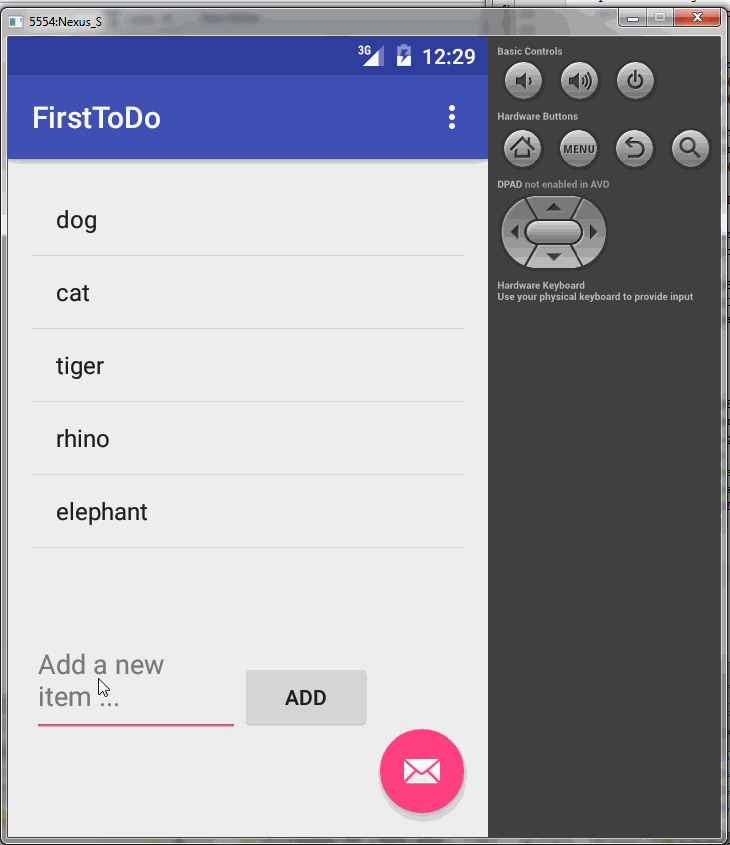

# android-todo-app

My First Android app - ToDo built following [Codepath training tutorial](http://courses.codepath.com/snippets/intro_to_android/prework.md).

Time spent: 10 hours spent in total

Completed user stories:

 * [x] Required: User can add and remove items from persistent ToDo list
 * [x] Required: User can edit item on the ToDo list
 
Notes:
Android Studio setup took a lot of time.  coding is a breeze.

Walkthrough of all user stories:

GIF created with [LiceCap](http://www.cockos.com/licecap/).

